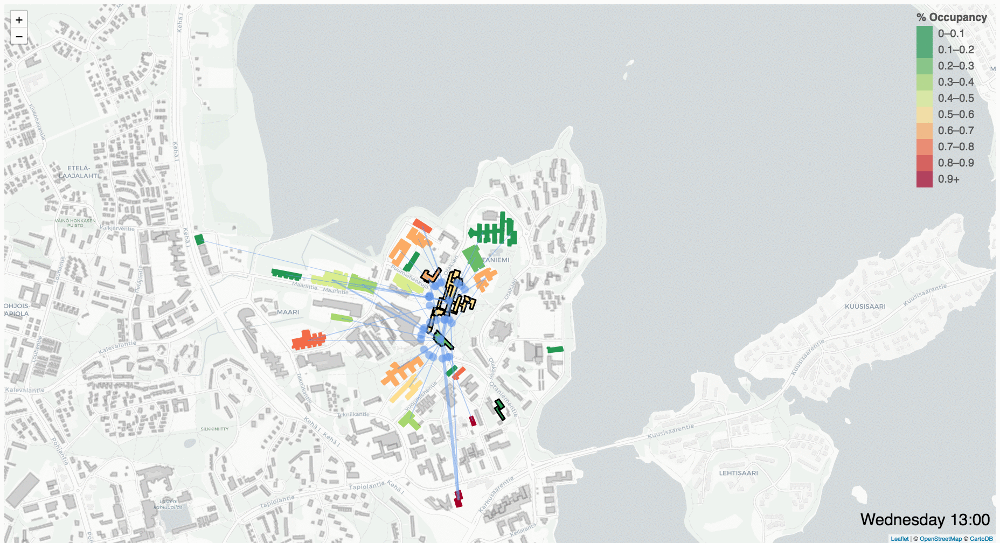

This folder contains files for analyzing the usage of building resources and simulating alternative service-oriented scenarios.

The python file buildingUsage.py requires 2 data files which are not contained in the repository: the building usage csv file and the buildings geojson file. After cloning the repository, both of these files must be placed into this folder. The .gitignore file will prevent any csv, json or geojson files in this directory from being git controlled or stored on the remote server.

The outputs of the buildingUsage.py script will be stored in the /Web/prepared directory. These json files will similary be ignored by git.

The web folder contains a webtool for visualising the results of the simulated scenarios.

